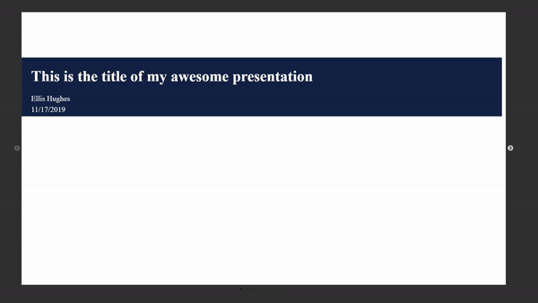

# sidescroller

<!-- badges: start -->
<!-- badges: end -->

The goal of sidescroll is to provide a unique way to generate slides through R and HTML. This is unlike a powerpoint presentation because it slowly scrolls through the slides, as if it were a story. The past slides can still be seen, providing context to the past while displaying the future.

## Installation

You can install the released version of sidescroll from [github](https://www.github.com/thebioengineer/sidescroller) with:

``` r
#install.packages("devtools")
devtools::install_github("thebioengineer/sidescroller")
```

## Example

This is a basic example which shows you how to set up your side scroller and the various slide types.

``` r
library(sidescroll)

example_scroller <- sidescroller() %>%
  title_slide(
    title = "This is the title of my awesome presentation",
    subtitle = c("Ellis Hughes","11/17/2019"),
    text_align = "left"
    )%>%
  slide_base(p("Oh Hello, world")) %>%
  slide_base(
    p("This slide is by default visible due to `visibility = TRUE`"),
    tags$ol(
     tags$li("Item 1"),
     tags$li("item 2")
    ),
    visibility = TRUE) %>%
  slide_base(
      img(src="https://66.media.tumblr.com/ee3deb2caceaa59c3dd0f80f82a37beb/tumblr_mpsej2j5rW1qz8x31o1_500.gifv")
      ) %>%
  slide_wide(
       title = "This is a wide slide",
       p("This slide will fill the width of the display"),
       p("The purpose could be to clear out the past display, or stage before the next section")
       ) %>% 
  markdown_slide("
        ## this is a test
        of the system
        _to generate_
        *html outputs*
        onthefly",
        visibility=FALSE) %>%
  markdown_slide("
            ## New slide header
            Testing the markdown
            1. making
              - a list
              - is easy in markdown
              - but
            2. will it render??

            Because I like [links](https://www.google.com)!
            ")
```
Use the `save_sidescroller()` function to save the sidescroller object as intended.

```r
save_sidescroller(example_scroller,"example_scroller.html")

```

The resulting presention looks like this:



Please note that the 'sidescroller' project is released with a
[Contributor Code of Conduct](CODE_OF_CONDUCT.md).
By contributing to this project, you agree to abide by its terms.
